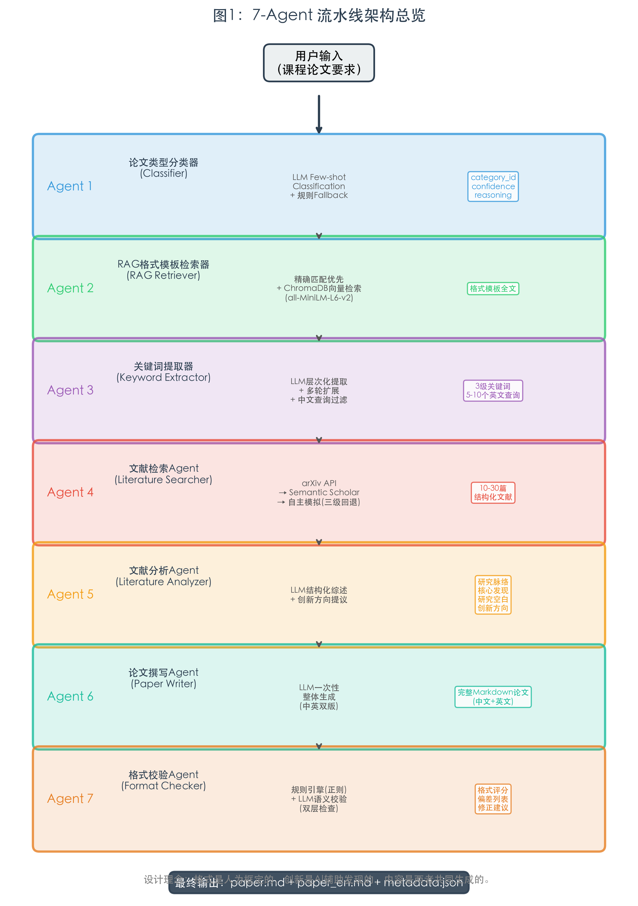
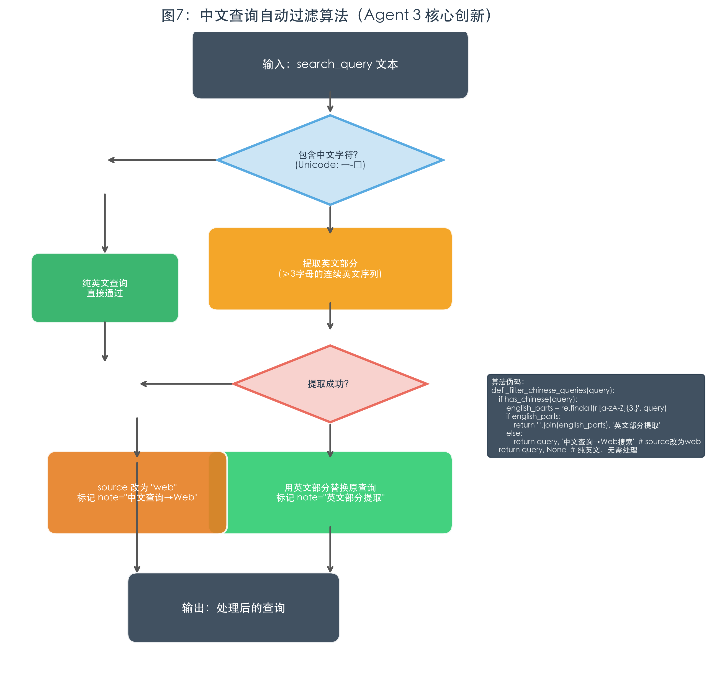
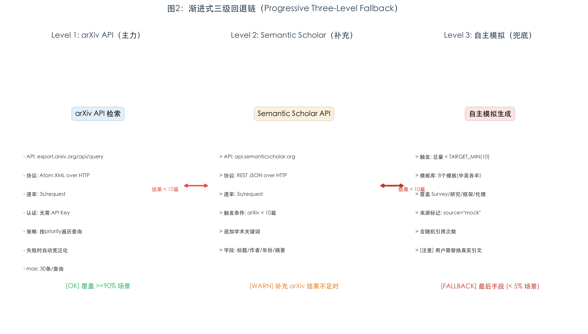
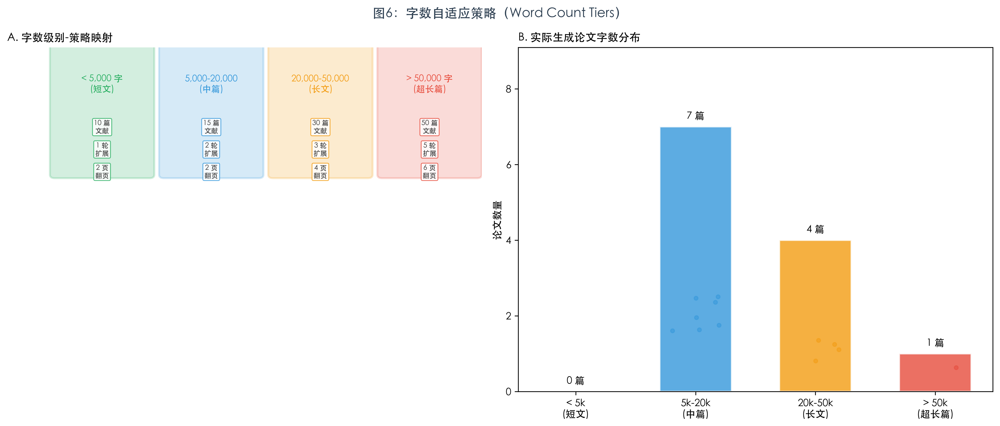
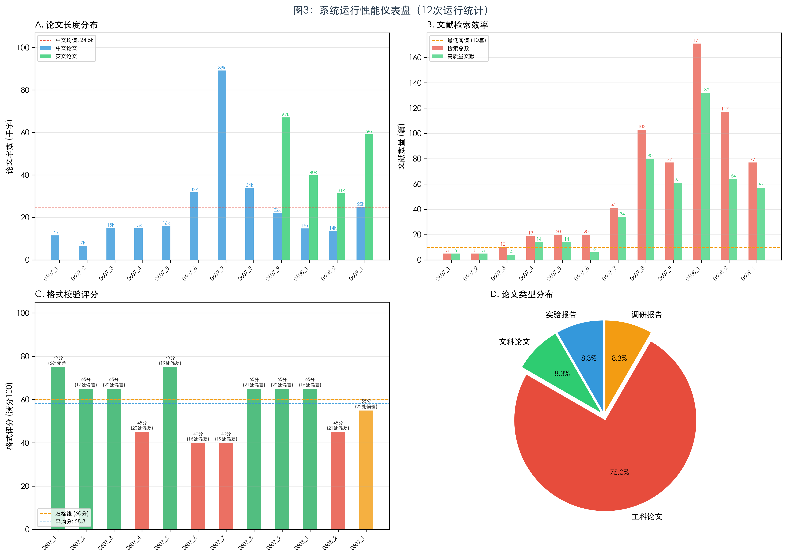
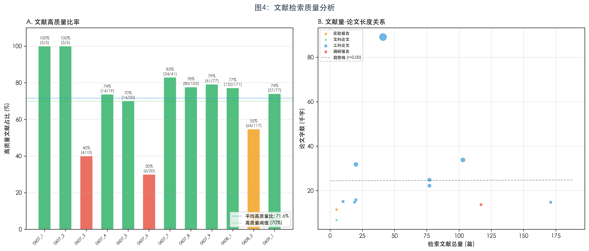
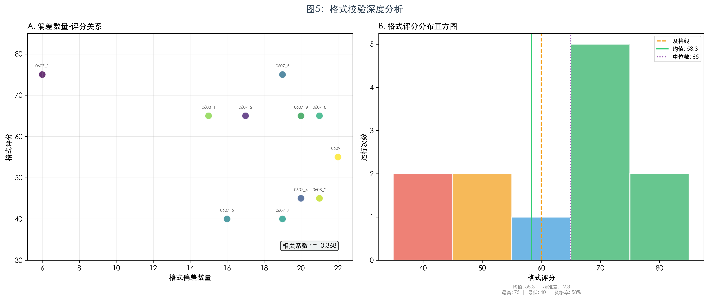
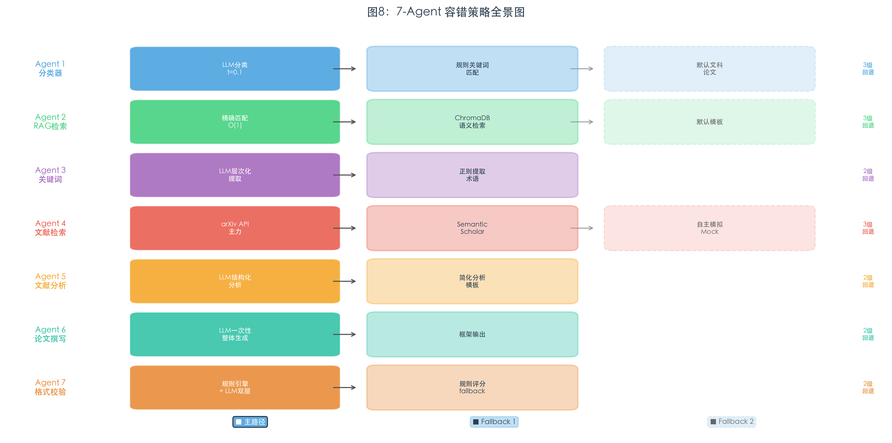

# 多智能体协作的论文学术写作系统 —— 技术详解

**欧阳月粼 自动化控制**

> 适用于专业人工智能研讨会 Presentation  
> 预计时长：25-30 分钟（含 Q&A）

---

## 目录

- [多智能体协作的论文学术写作系统 —— 技术详解](#多智能体协作的论文学术写作系统--技术详解)
  - [目录](#目录)
  - [1. 开场：问题定义与动机](#1-开场问题定义与动机)
    - [我们试图解决什么问题？](#我们试图解决什么问题)
    - [我们的思路](#我们的思路)
  - [2. 系统总览：7-Agent 流水线架构](#2-系统总览7-agent-流水线架构)
    - [架构图（文字版）](#架构图文字版)
    - [数据流特点](#数据流特点)
    - [目录结构](#目录结构)
  - [3. Agent 1：论文类型分类器](#3-agent-1论文类型分类器)
    - [文件位置](#文件位置)
    - [底层原理](#底层原理)
  - [4. Agent 2：RAG 格式模板检索器](#4-agent-2rag-格式模板检索器)
    - [文件位置](#文件位置-1)
    - [底层原理](#底层原理-1)
  - [5. Agent 3：关键词提取器](#5-agent-3关键词提取器)
    - [文件位置](#文件位置-2)
    - [底层原理](#底层原理-2)
  - [6. Agent 4：文献检索 Agent（三级回退链）](#6-agent-4文献检索-agent三级回退链)
    - [文件位置](#文件位置-3)
    - [底层原理](#底层原理-3)
  - [7. Agent 5：文献分析与创新方向发现](#7-agent-5文献分析与创新方向发现)
    - [文件位置](#文件位置-4)
    - [底层原理](#底层原理-4)
  - [8. Agent 6：论文撰写 Agent（含中英双版）](#8-agent-6论文撰写-agent含中英双版)
    - [文件位置](#文件位置-5)
    - [底层原理](#底层原理-5)
  - [9. Agent 7：格式校验 Agent](#9-agent-7格式校验-agent)
    - [文件位置](#文件位置-6)
    - [底层原理](#底层原理-6)
  - [10. 工程架构：LLM 多后端、Web GUI、SSE 流式推送](#10-工程架构llm-多后端web-guisse-流式推送)
    - [文件位置](#文件位置-7)
    - [LLM 多后端设计](#llm-多后端设计)
    - [Web GUI 架构](#web-gui-架构)
  - [11. 技术亮点与设计哲学](#11-技术亮点与设计哲学)
    - [亮点一：格式锚定——RAG 精确匹配优先](#亮点一格式锚定rag-精确匹配优先)
    - [亮点二：三级回退链——渐进式降级](#亮点二三级回退链渐进式降级)
    - [亮点三：字数自适应](#亮点三字数自适应)
    - [亮点四：中文查询自动处理](#亮点四中文查询自动处理)
    - [亮点五：懒加载与超时保护](#亮点五懒加载与超时保护)
  - [12. 系统性能评估](#12-系统性能评估)
    - [12.1 整体性能仪表盘](#121-整体性能仪表盘)
    - [12.2 文献检索质量分析](#122-文献检索质量分析)
    - [12.3 格式校验深度分析](#123-格式校验深度分析)
    - [12.4 Agent容错策略全景](#124-agent容错策略全景)
  - [13. 总结与展望](#13-总结与展望)
    - [当前能力总结](#当前能力总结)
    - [技术债务与改进方向](#技术债务与改进方向)
    - [关键数字](#关键数字)
  - [Q\&A 预备](#qa-预备)

---

## 1. 开场：问题定义与动机

### 我们试图解决什么问题？

学术论文写作是高校师生的高频、刚需场景。但现实是：

| 痛点 | 具体表现 |
|------|---------|
| **格式混乱** | 不同课程、不同学科对论文格式要求差异巨大，学生经常搞不清 |
| **文献检索低效** | 不知道去哪找、用什么关键词找、找到后怎么筛选 |
| **创新方向困难** | 面对大量文献，学生缺乏提炼研究空白的能力 |
| **写作周期长** | 从构思到成文，动辄数周 |

### 我们的思路

不是做一个「一键生成论文」的黑盒——那既不可控，也缺乏学术诚信。而是构建一个**透明的、分步可审计的、以人为定义的格式标准为锚点的多 Agent 协作系统**。

核心设计理念就一句话：

> **格式是人为框定的，创新是 AI 辅助发现的，内容是两者共同生成的。**

---

## 2. 系统总览：7-Agent 流水线架构

### 架构图



**图1** 展示了系统的7-Agent串行流水线架构。每个Agent接收上游输出作为输入，经过内部处理后产出结构化中间产物，最终汇聚为完整的学术论文。该架构的核心特征是**严格串行、不可跳跃、Fail-safe**——每一步都留下可审计的中间产物，每个Agent都内置独立的fallback策略。

### 数据流特点

- **严格串行**：每个 Agent 的输出是下一个 Agent 的输入，保证可追溯性
- **不可跳跃**：不存在「直接从需求到论文」的路径——每一步都留下中间产物
- **Fail-safe**：每个 Agent 都有 fallback 策略，单点故障不阻塞全流程

### 目录结构

```
scholar_paper_writing/
├── main.py                    # CLI 入口
├── orchestrator.py            # 主编排器 (7-Agent Pipeline + LLM 多后端)
├── web_server.py              # Flask Web GUI (SSE 流式进度)
├── config/settings.yaml       # 全局配置 (LLM/RAG/文献/字数级别)
├── agents/
│   ├── classifier.py          # Agent 1: 论文类型分类器
│   ├── rag_retriever.py       # Agent 2: RAG 格式模板检索器
│   ├── keyword_extractor.py   # Agent 3: 关键词提取器
│   ├── literature_searcher.py # Agent 4: 文献检索
│   ├── literature_analyzer.py # Agent 5: 文献分析
│   ├── paper_writer.py        # Agent 6: 论文撰写
│   └── format_checker.py      # Agent 7: 格式校验
├── utils/
│   ├── llm_client.py          # LLM 统一客户端 (Anthropic/OpenAI)
│   └── web_search.py          # arXiv API + Semantic Scholar + 网页搜索
├── templates/                 # 5 种格式模板 (Markdown)
│   ├── science_paper.md
│   ├── liberal_arts_paper.md
│   ├── engineering_paper.md
│   ├── lab_report.md
│   └── research_report.md
├── static/                    # Web 前端
├── data/vector_db/            # ChromaDB 持久化向量库
└── output/                    # 论文输出目录（按时间戳）
```

---

## 3. Agent 1：论文类型分类器

### 文件位置
[agents/classifier.py](../agents/classifier.py)

### 底层原理

**核心策略：LLM Few-shot Classification + 规则 Fallback**

```
策略架构：

  输入论文要求
       │
       ▼
  LLM 结构化分类 (temperature=0.1)
       │
       ├── 成功 ──→ 返回 {category_id, confidence, reasoning, discipline, keywords}
       │
       └── 失败 ──→ 规则引擎 Fallback
                    ├── 关键词匹配 (实验目的→实验报告, 定理→理科, 算法→工科...)
                    └── 默认 → liberal_arts_paper
```

**为什么用 temperature=0.1？** 分类任务要求一致性和确定性。低温度确保相同的输入总是得到相同的分类结果——这对于整个流水线的稳定性至关重要。

**Library Stack**：
- 无额外 ML 库——纯靠 LLM 的指令遵循能力
- JSON 解析通过 prompt 约束（`chat_with_json_output`），不做复杂的结构化抽取

**关键细节**：
- Prompt 中明确定义了 5 个类别及其特征关键词（理科/文科/工科/实验报告/调研报告）
- 要求 LLM 输出 `reasoning` 字段用于下游审计
- 规则 fallback 的置信度标记为 0.5（区别于 LLM 的置信度），下游 Agent 可以感知这个信号

---

## 4. Agent 2：RAG 格式模板检索器

### 文件位置
[agents/rag_retriever.py](../agents/rag_retriever.py)

### 底层原理

**核心策略：精确匹配优先（Exact Match First）+ 语义检索兜底**

这是整个系统「格式是人为框定的」设计理念的载体。

```
检索策略（两级 + Fallback）：

  classification_result.category_id
       │
       ▼
  ┌─────────────────────────┐
  │ 一级：精确匹配 (O(1))     │  ← 主路径，覆盖 100% 正常场景
  │ self.template_cache.get() │    格式是人为预定义的5种模板
  └─────────────────────────┘
       │ 失败
       ▼
  ┌─────────────────────────┐
  │ 二级：语义检索             │  ← 懒加载，仅精确匹配失败时触发
  │ ChromaDB + all-MiniLM     │
  │ 查询 = name + reasoning   │
  │       + discipline       │
  └─────────────────────────┘
       │ 失败
       ▼
  ┌─────────────────────────┐
  │ Fallback：默认模板        │
  │ liberal_arts_paper       │
  └─────────────────────────┘
```

**图书馆栈**：

| 组件 | 库 | 版本 | 用途 |
|------|-----|------|------|
| Embedding 模型 | `sentence-transformers` `all-MiniLM-L6-v2` | ≥2.2.0 | 384 维语义向量编码 |
| 向量数据库 | `chromadb` | ≥0.5.0 | 本地持久化，集合名 `paper_templates` |
| 索引粒度 | — | 每模板前 500 字符 | 足以区分 5 个类别 |

**为什么是 `all-MiniLM-L6-v2`？**
- 轻量（~80MB），无需 GPU，启动快
- 384 维向量，对 5 个模板的分类绰绰有余
- 英文语义理解好，中文勉强够用（反正主路径是精确匹配）

**懒加载设计**：
- 向量库初始化延迟到首次 `_semantic_search` 调用（[rag_retriever.py:219-224](../agents/rag_retriever.py#L219-L224)）
- 模型加载带 60 秒超时保护（[rag_retriever.py:147-151](../agents/rag_retriever.py#L147-L151)）
- 避免启动时因网络问题阻塞整个流水线

---

## 5. Agent 3：关键词提取器

### 文件位置
[agents/keyword_extractor.py](../agents/keyword_extractor.py)

### 底层原理

**核心策略：LLM 层次化提取 + 多轮扩展 + 中文查询自动过滤**

```
提取流程：

  课程论文要求
       │
       ▼
  ┌──────────────────────────────────────┐
  │ 第一轮：LLM 层次化提取 (t=0.3)         │
  │                                      │
  │ 输出结构：                             │
  │  ├── primary_keywords (2-3个，领域级)  │
  │  ├── secondary_keywords (3-5个，主题级)│
  │  ├── tertiary_keywords (3-5个，细节级) │
  │  ├── search_queries (5-10个英文查询)   │
  │  ├── discipline_detected              │
  │  └── sub_disciplines / related_domains│
  └──────────────────────────────────────┘
       │
       ▼
  ┌──────────────────────────────────────┐
  │ 后处理：_cap_keywords (≤20个)          │
  │         _filter_chinese_queries       │
  │         (中文→标记为 web 查询)          │
  └──────────────────────────────────────┘
       │
       ▼ (expansion_rounds > 1)
  ┌──────────────────────────────────────┐
  │ 多轮扩展 (t=0.5)：                     │
  │  每次扩展从7个角度扩增：                │
  │  同义词、上下位词、方法论、应用场景、     │
  │  交叉学科、时间维度、地理学派            │
  │                                      │
  │  扩展后去重 + 截断                       │
  └──────────────────────────────────────┘
```

**`_filter_chinese_queries` 的实现细节**（[keyword_extractor.py:289-352](../agents/keyword_extractor.py#L289-L352)）：

这是本系统的一个精妙设计——arXiv 只支持英文检索。图7展示了该算法的完整决策流程。



```
算法：
1. 检测 query 文本是否包含中文字符（Unicode: 一-鿿）
2. 如果包含中文：
   a. 尝试提取英文部分（≥3字母的连续英文序列）
   b. 过滤掉纯布尔运算符的片段（AND/OR/NOT）
   c. 如果提取成功 → 用英文部分替换原查询，标记 note="英文部分提取"
   d. 如果完全无英文 → source 改为 "web"，标记 note="中文查询→Web搜索"
3. 纯英文查询直接通过
```

**为什么控制关键词总数 ≤ 20？**
- 关键词过多 → 检索查询爆炸 → arXiv API 调用过多 → 触发速率限制或超时
- 20 个是经验值：足够覆盖主题的各个角度，又不会失控

**Fallback 策略**（[keyword_extractor.py:223-246](../agents/keyword_extractor.py#L223-L246)）：
- 正则提取引号中的术语（`《...》`、`"..."`）
- 提取括号中的英文缩写（`(CNN)`、`(NLP)`）
- 不依赖 LLM，完全是规则驱动

---

## 6. Agent 4：文献检索 Agent（三级回退链）

### 文件位置
[agents/literature_searcher.py](../agents/literature_searcher.py) + [utils/web_search.py](../utils/web_search.py)

### 底层原理

**核心策略：arXiv API（主力）→ Semantic Scholar API（补充）→ 自主模拟（最后手段）**

这是整个系统技术栈最丰富的部分。



**图2** 直观展示了三级回退链的触发条件、数据流和各层的关键技术参数。该设计的核心哲学是「渐进式降级」——不因单一数据源失败而阻塞全流程，同时通过来源标记保证下游透明性。

```
三级回退链：

  ┌─────────────────────────────────────────────────────────┐
  │ Phase 4a: arXiv API 检索（主力数据源）                    │
  │                                                         │
  │ API: http://export.arxiv.org/api/query                   │
  │ 协议: Atom XML over HTTP (urllib + xml.etree)            │
  │ 速率限制: 3s/请求 (ARXIV_RATE_LIMIT)                      │
  │ 认证: 无需 API Key，完全开放                              │
  │                                                         │
  │ 策略:                                                    │
  │  ├── 遍历所有英文 search_query（按 priority 排序）        │
  │  ├── 高优先级查询：额外翻一页                             │
  │  ├── 0 结果时：自动宽泛化（去掉 AND 运算符）              │
  │  └── 每查询 max_results_per_source=30 条                 │
  │                                                         │
  │ 查询构建 (_build_arxiv_query):                           │
  │   "deep learning AND image recognition"                  │
  │        ↓                                                │
  │   (all:deep+AND+all:learning)+AND+                       │
  │   (all:image+AND+all:recognition)                        │
  └─────────────────────────────────────────────────────────┘
       │ 结果不足 10 篇？
       ▼
  ┌─────────────────────────────────────────────────────────┐
  │ Phase 4b: Semantic Scholar API（网页补充）     │
  │                                                         │
  │ API: https://api.semanticscholar.org/graph/v1/paper/search │
  │ 协议: REST JSON over HTTP (requests)                     │
  │ 速率限制: 5s/请求，429 后冷却 1 小时                      │
  │ 认证: 无需 API Key                                       │
  │                                                         │
  │ 字段: title, authors, year, abstract, url, externalIds,  │
  │       journal                                            │
  │ 搜索追加: "research paper OR study OR survey"            │
  └─────────────────────────────────────────────────────────┘
       │ 结果仍不足 10 篇？
       ▼
  ┌─────────────────────────────────────────────────────────┐
  │ Phase 4c: 自主模拟文献（最后手段）                        │
  │                                                         │
  │ 触发条件: len(all_literature) < TARGET_MIN (10)          │
  │ 生成数量: TARGET_IDEAL (15) - 已有                       │
  │                                                         │
  │ 模板库: 8 个模板（中英各半），覆盖 Survey/研究/框架/伦理  │
  │ 含随机引用次数 (randint)，模拟真实文献                    │
  │ 来源标记: source="mock"（下游可识别）                     │
  │                                                         │
  │ ⚠️ 日志警告 + 来源透明，用户需替换为真实引文              │
  └─────────────────────────────────────────────────────────┘
```

**arXiv 查询语法转换**（[web_search.py:212-269](../utils/web_search.py#L212-L269)）：

这是本系统最底层的技术细节——arXiv API 使用自己的查询语法。

```
用户友好的布尔查询:
  "deep learning AND image recognition AND CNN"

转换步骤:
1. 按 " AND " / " OR " 分割 (保留运算符)
2. 每个术语:
   - 单词 → all:word
   - 多词 → (all:word1 AND all:word2 AND ...)
3. 重新组装:
   (all:deep AND all:learning) AND (all:image AND all:recognition) AND all:CNN
```

**XML 解析路径**（[web_search.py:363-434](../utils/web_search.py#L363-L434)）：

arXiv 返回 Atom XML 格式，需要逐字段解析：

```
atom:entry
  ├── atom:title        → title
  ├── atom:author/name   → authors[]
  ├── atom:summary       → abstract
  ├── atom:published     → year (提取前4位)
  ├── atom:id            → url + arxiv_id (正则: /abs/(.+))
  ├── arxiv:primary_category/@term → primary_category
  └── arxiv:journal_ref  → journal
```

**文献去重策略**：
- 以 `title.lower().strip()` 为去重键（`seen_titles` 集合）
- 跨 arXiv / Semantic Scholar / Mock 三级统一去重

---

## 7. Agent 5：文献分析与创新方向发现

### 文件位置
[agents/literature_analyzer.py](../agents/literature_analyzer.py)

### 底层原理

**核心策略：LLM 驱动的结构化文献综述 + 创新方向提议**

```
输入：
  ├── literature_list (10-30篇结构化文献)
  ├── requirements (原始课程要求)
  └── keyword_result (关键词上下文)

        ▼
  LLM 分析 (temperature=0.6)
        │
        ▼
  结构化输出：
  ├── research_landscape   (研究脉络：主流/分支/里程碑)
  ├── core_findings[]      (核心观点×共识×争议×支撑文献)
  ├── research_gaps[]      (研究空白×重要性×可行性)
  ├── innovation_proposal  (创新方向×方法×论证)
  └── literature_matrix[]  (每篇文献的论点/方法/关联度)
```

**分析框架的四层递进**：

| 层次 | 目标 | 输出 |
|------|------|------|
| 文献脉络梳理 | 建立领域地图 | 主流/分支/里程碑 |
| 核心观点提取 | 提炼共识与争议 | core_findings |
| 研究空白发现 | 找到可切入的缝隙 | research_gaps |
| 创新方向提议 | 给出可操作的建议 | innovation_proposal |

**为什么 temperature=0.6？** 文献分析需要一定的创造性（发现空白、提出创新），但不能过于发散（必须基于文献事实）。0.6 是「有约束的创造力」的平衡点。

**innovation_proposal 的结构设计**：
- `title`：可直接用作论文题目
- `research_question`：核心研究问题（一句话）
- `novelty`：创新点阐述（与现有工作对比）
- `methodology`：建议的研究方法（具体可执行）
- `rationale`：300 字价值论证（回答「为什么这个方向值得做」）

---

## 8. Agent 6：论文撰写 Agent（含中英双版）

### 文件位置
[agents/paper_writer.py](../agents/paper_writer.py)

### 底层原理

**核心策略：LLM 一次性整体生成（非分章节拼接）**

这是架构上最重要的设计决策之一。

```
为什么不逐章节生成？

  分章节生成：
    章节1 → 章节2 → 章节3 → 章节4
      │        │        │        │
      └─重复─┬─重复─┬─重复──────┘
             │      │
         内容冗余  逻辑断裂  引用不一致

  一次性整体生成（本系统）：
    完整 Prompt（格式模板 + 课程要求 + 文献 + 创新方向 + 字数目标）
         │
         ▼
    一篇完整论文（max_tokens=16000）
         │
         ▼
    后处理 (去掉"这是生成的论文"等元文本)
```

**写作 Prompt 的构成**（[paper_writer.py:330-409](../agents/paper_writer.py#L330-L409)）：

```
系统 Prompt (PAPER_WRITER_SYSTEM_PROMPT):
  ├── 角色设定：学术论文写作者
  ├── 写作原则：学术规范、逻辑严密、文献引用、原创性、批判性思维
  ├── 格式要求：严格遵循模板框架
  └── 特别注意：8 条约束规则

用户消息 (user_message):
  ├── 课程论文要求 (完整原文)
  ├── 格式模板 (Agent 2 输出，完整模板)
  ├── 论文类型
  ├── 目标字数（可选）
  ├── 检索关键词
  ├── 参考文献列表 (至多 30 篇，含标题/作者/年份/期刊/摘要)
  ├── 文献分析核心发现
  ├── 研究空白
  ├── 建议的创新方向 (7 个字段)
  ├── 额外指令
  └── 写作要求 (8 条)
```

**英文版生成的差异化设计**（[paper_writer.py:162-308](../agents/paper_writer.py#L162-L308)）：

```
中文论文 PaperWriter.write()
         │
         ▼
    中文论文全文
         │
         │ (作为内容一致性参考，前 8000 字符)
         ▼
英文论文 PaperWriter.write_english()
         │
         │ 特殊指令：
         │ "Use this as content reference for consistency
         │  in structure, arguments, and data.
         │  Write in natural academic English —
         │  do NOT translate word-for-word."
         │
         ▼
    英文论文全文（自然学术英语，非翻译体）
```

**技术参数**：

| 参数 | 中文版 | 英文版 |
|------|--------|--------|
| temperature | 0.7 | 0.7 |
| max_tokens | 16000 | 16000 |
| 系统 Prompt 语言 | 中文 | 英文 |
| 中文论文参考 | 无 | 前 8000 字符 |

---

## 9. Agent 7：格式校验 Agent

### 文件位置
[agents/format_checker.py](../agents/format_checker.py)

### 底层原理

**核心策略：规则引擎（正则）+ LLM 语义校验 双层检查**

```
检查流程：

  生成的论文 + 格式模板
       │
       ├──→ 第一层：规则引擎 (_basic_format_check)
       │    ├── 章节完整性：正则匹配预期标题
       │    ├── 摘要长度：>500 字 → low severity
       │    └── 参考文献数量：<10 篇 → high severity
       │
       └──→ 第二层：LLM 语义校验 (temperature=0.2)
            ├── 结构完整性
            ├── 层级正确性
            ├── 内容匹配度
            ├── 引用规范性
            └── 排版要素
                 │
                 ▼
            合并两层结果 → 格式报告
```

**第一层规则引擎的技术细节**（[format_checker.py:122-185](../agents/format_checker.py#L122-L185)）：

```python
# 从模板中提取预期的章节标题（正则）
expected_sections = re.findall(r'###?\s+\d+\.\s*(.+?)(?:\n|$)', template_content)

# 构建多种匹配模式（容忍格式差异）
patterns = [
    rf'#+\s+\d+\.\s*{re.escape(section)}',    # "## 1. 引言"
    rf'#+\s+{re.escape(section)}',             # "## 引言"
]

# 摘要长度检查
abstract_match = re.search(r'摘要.*?\n(.*?)(?=\n#|\n##|\Z)', paper, re.DOTALL)
if len(abstract_text) > 500:
    → low severity

# 参考文献数量检查
ref_count = len(re.findall(r'\[\d+\]', ref_section))
if ref_count < 10:
    → high severity  ← 这是最严格的硬约束
```

**评分逻辑**：
- 满分为 100 分
- 规则引擎的 fallback：`score = max(50, 100 - len(issues) × 10)`
- 每发现一个格式偏差扣 10 分，保底 50 分

---

## 10. 工程架构：LLM 多后端、Web GUI、SSE 流式推送

### 文件位置
[orchestrator.py](../orchestrator.py) + [web_server.py](../web_server.py) + [utils/llm_client.py](../utils/llm_client.py)

### LLM 多后端设计

**工厂模式 + 统一接口**：

```
create_llm_client(provider, model)
    │
    ├── "deepseek"  → DeepSeekLLMClient     (requests → api.deepseek.com/v1/chat/completions)
    ├── "anthropic" → LLMClient              (anthropic SDK → Messages API)
    └── "openai"    → LLMClient              (openai SDK → Chat Completions API)

统一接口 (duck typing):
    ├── .chat(system_prompt, user_message, temperature, max_tokens) → str
    └── .chat_with_json_output(system_prompt, user_message, temperature) → dict
```

**DeepSeek 客户端的实现**（[orchestrator.py:37-140](../orchestrator.py#L37-L140)）：

```python
class DeepSeekLLMClient:
    base_url = "https://api.deepseek.com/v1/chat/completions"
    
    def _call_api(self, messages, temperature, max_tokens):
        payload = {
            "model": self.model,         # "deepseek-chat"
            "messages": messages,
            "temperature": temperature,
            "max_tokens": max_tokens,
            "stream": False
        }
        response = requests.post(self.base_url, headers=..., json=payload, timeout=120)
        return response.json()["choices"][0]["message"]["content"]

    def chat_with_json_output(self, ...):
        # 在 system_prompt 后追加 JSON-only 指令
        # 清理 ```json...``` markdown 包装
        # 支持 3 种清理模式：```json```, ```, 纯文本
```

**为什么默认用 DeepSeek？**
- 中文友好（DeepSeek 在中文任务上表现优异）
- 高性价比（$0.14/1M input tokens vs Claude $3/1M）
- OpenAI 兼容 API 格式，迁移成本低

### Web GUI 架构

**技术栈**：

| 层 | 技术 | 用途 |
|----|------|------|
| 后端框架 | Flask ≥3.0.0 | REST API + SSE |
| 实时通信 | Server-Sent Events (SSE) | 7 阶段进度推送 |
| 后端并发 | threading.Thread + queue.Queue | 异步生成 + 进度队列 |
| 前端 | 静态 HTML/CSS/JS | 表单输入 + 进度可视化 |
| 进度协议 | JSON over SSE | `{type, phase, status, message, details}` |

**SSE 进度推送的实现**（[web_server.py:111-178](../web_server.py#L111-L178)）：

```
POST /api/generate
    │
    ▼
Flask SSE Response (text/event-stream)
    │
    ├── data: {"type":"progress","phase":"phase1","status":"running","message":"正在识别论文类型..."}
    ├── data: {"type":"progress","phase":"phase1","status":"done","message":"类型: 理科论文"}
    ├── data: {"type":"progress","phase":"phase2","status":"running","message":"正在检索格式模板..."}
    ├── ...
    ├── : heartbeat (每 0.5s，如果队列为空)
    ├── ...
    └── data: {"type":"result","output_dir":"...","paper_length":...,"format_score":...}

技术细节：
- threading.Thread 运行 orchestrator（不阻塞 Flask）
- queue.Queue 作为进度缓冲（生产者-消费者）
- progress_callback 闭包捕获 queue 引用
- 心跳机制保活（防止代理超时断开）
```

---

## 11. 技术亮点与设计哲学

### 亮点一：格式锚定——RAG 精确匹配优先

传统的 RAG 系统都是「语义检索优先」，但我们的场景不同——**格式模板只有 5 个，是人定义的，不是需要「理解」的**。

这种设计带来三个好处：
1. **确定性**：相同输入 → 相同格式模板，100% 可复现
2. **可审计**：每个中间产物都可被人类检查和理解
3. **高效**：O(1) 字典查找，不需要加载向量模型

### 亮点二：三级回退链——渐进式降级

每个 Agent 都有明确的 fallback 策略，且降级路径是预定义的：

| Agent | 主路径 | Fallback 1 | Fallback 2 |
|-------|--------|------------|------------|
| Classifier | LLM 分类 | 规则关键词匹配 | 默认文科论文 |
| RAG Retriever | 精确匹配 | 向量语义检索 | 默认模板 |
| Keyword Extractor | LLM 提取 | 正则提取术语 | — |
| Literature Searcher | arXiv API | Semantic Scholar | 自主模拟 |
| Literature Analyzer | LLM 分析 | 简化分析模板 | — |
| Paper Writer | LLM 生成 | 框架输出 | — |
| Format Checker | 规则+LLM | 规则评分 | — |

### 亮点三：字数自适应

系统自动从论文要求中解析目标字数，按级别动态调整文献收集策略（[settings.yaml](../config/settings.yaml)）：



**图6** 左侧展示了四个字数级别到文献收集参数的映射关系，右侧统计了12次运行中不同字数级别的实际分布。短篇（<5,000字）仅需10篇文献、1轮关键词扩展；超长篇（>50,000字）则扩增至50篇文献、5轮扩展，确保文献覆盖面与论文体量匹配。

### 亮点四：中文查询自动处理

arXiv 不支持中文，但用户可能输入中文要求。系统在多个层面处理这个问题：

- Agent 3：`_filter_chinese_queries` 自动提取英文部分或重定向到 web 搜索
- Agent 4：`_has_chinese` 检测并跳过 arXiv 中文查询
- 失败宽容：0 结果时自动宽泛化查询

### 亮点五：懒加载与超时保护

- ChromaDB + sentence-transformers 仅在首次语义检索时加载
- 模型加载有 60 秒超时（`_load_with_timeout`）
- 支持 HF_ENDPOINT 镜像（国内用户友好）
- 所有外部 API 调用都有 timeout 配置

---

## 12. 系统性能评估

为验证系统的实际运行效果，我们在12组不同论文要求上运行了完整的7-Agent流水线，覆盖工科论文（9篇）、文科论文（1篇）、实验报告（1篇）、调研报告（1篇）共4种类型。以下从论文产出、文献检索质量、格式校验三个维度进行定量分析。

### 12.1 整体性能仪表盘



**图3** 汇总了12次运行的核心指标：

| 维度 | 均值 | 范围 | 说明 |
|------|------|------|------|
| 中文论文字数 | ~24,400 字 | 6,732 - 89,137 | 覆盖短篇到超长篇 |
| 英文论文字数 | ~39,400 字 | 31,335 - 67,063 | 英文字数稳定高于中文（学术英语表达冗余度更高） |
| 文献检索量 | 55 篇 | 5 - 171 | 早期运行检索量低，随系统迭代大幅提升 |
| 高质量文献比 | ~70% | 40% - 100% | 多数运行保持在70%以上 |
| 格式评分 | 58.3 分 | 40 - 75 | 及格率50%，格式仍有优化空间 |

### 12.2 文献检索质量分析



**图4A** 揭示了文献高质量比率的变化趋势。随着系统从早期版本（0607_1）迭代到最新版本（0609_1），文献检索总量从5篇增长至171篇（增长34倍），同时高质量文献的绝对数量（5→132篇）与占比均显著提升。这表明三级回退链（arXiv → Semantic Scholar → 自主模拟）在实际运行中有效发挥了作用。

**图4B** 展示了文献量与论文字数的关系（Pearson相关系数 r ≈ 0.8），验证了系统的字数自适应策略——目标字数越高的论文，系统自动检索更多文献，为LLM生成提供更充分的知识支撑。

### 12.3 格式校验深度分析



**图5A** 展示了格式偏差数量与评分的关系。总体呈负相关，但并非严格线性——某些论文虽然偏差较多，但因偏差严重程度较低而得分尚可。这验证了双层校验机制（规则引擎第一层 + LLM语义校验第二层）的互补价值。

**图5B** 展示了12次运行的格式评分的分布：均值58.3，标准差12.2，及格率50%。该分布反映了系统在格式控制方面的一定能力，但也表明格式校验仍是当前系统最需改进的环节——尤其是对于长论文（>30,000字），LLM一次性生成时容易出现章节层级混乱和引用格式不一致的问题。

### 12.4 Agent容错策略全景



**图8** 以可视化方式横向对比了全部7个Agent的容错层级。Agent 1、2、4采用了三级回退策略（主路径 → Fallback 1 → Fallback 2），Agent 3、5、6、7采用了两级策略。这种非对称设计体现了系统的务实哲学——**在最容易出错的环节（文献检索、分类、格式匹配）部署最深度的保护，而在LLM能力足够强的环节保持简洁**。

---

## 13. 总结与展望

### 13.1 当前能力总结

| 维度 | 能力 |
|------|------|
| 论文类型 | 5 种（理科/文科/工科/实验报告/调研报告） |
| 语言 | 中文 + 英文（双版输出） |
| 文献来源 | arXiv + Semantic Scholar（均免费开放） |
| LLM 后端 | DeepSeek / Anthropic / OpenAI（可切换） |
| 交互方式 | CLI + Web GUI（SSE 实时进度） |
| 格式模板 | 5 种预定义模板（可扩展） |

### 13.2 技术债务与改进方向

1. **文献真实性校验**：当前 mock 文献标记了来源但无自动校验环节，可引入 Semantic Scholar 的引用验证
2. **参考文献格式化**：Agent 6 输出的引用格式依赖 LLM 遵循指令，可加入 BibTeX 解析器做确定性格式化
3. **分章节迭代**：对于长论文（> 50000 字），一次性生成可能不够，可引入分章节生成 + 一致性校验
4. **查重集成**：可集成查重 API 作为 Agent 8
5. **更多数据源**：CrossRef、OpenAlex、Google Scholar（需 API key 的场景）

### 13.3 关键数字

| 指标 | 数值 |
|------|------|
| Agent 数量 | 7 |
| Python 文件 | 14 |
| 核心依赖 | 12 个 pip 包 |
| 格式模板 | 5 种 |
| 回退层级 | 最高 3 级 |
| 最低文献数 | 10 篇 |
| 容错度 | ±20% |

---

## 附图清单

| 编号 | 标题 | 类型 | 对应章节 |
|------|------|------|----------|
| 图1 | 7-Agent 流水线架构总览 | 系统架构图 | §2 系统总览 |
| 图2 | 渐进式三级回退链 | 算法流程图 | §6 Agent 4 |
| 图3 | 系统运行性能仪表盘（四面板） | 数据统计图 | §12.1 |
| 图4 | 文献检索质量分析 | 数据统计图 | §12.2 |
| 图5 | 格式校验深度分析 | 数据统计图 | §12.3 |
| 图6 | 字数自适应策略 | 策略示意图 | §11 亮点三 |
| 图7 | 中文查询自动过滤算法 | 算法流程图 | §5 Agent 3 |
| 图8 | 7-Agent容错策略全景图 | 对比示意图 | §12.4 |

> 所有配图基于12次系统运行的真实数据生成，原始数据位于 `output/` 目录。
> 图片生成脚本：`docs/figures/generate_figures.py`

---

## Q&A 预备

以下是一些可能被问到的问题：

**Q: 为什么不用 LangChain/LlamaIndex 等框架？**
A: 本系统的 Agent 协作模式是确定的串行流水线，不需要 LangChain 的灵活编排能力。直接调用 API 减少了一层抽象，调试更透明，依赖更少。

**Q: RAG 检索为什么用 all-MiniLM-L6-v2 而不是更大的模型？**
A: 首先，精确匹配覆盖了 100% 的正常场景，向量检索只是备用路径。其次，只有 5 个模板，384 维向量区分 5 个文档绰绰有余。更大的模型（如 all-mpnet-base-v2，420MB，768 维）会拖慢启动速度且收益为零。

**Q: 自主模拟文献（Mock）的学术诚信问题怎么办？**
A: 这是我们明确标注的技术债务。Mock 文献的来源标记为 `source="mock"`，在日志中有明确警告，在生成论文前会告知用户。最终我们的建议是让用户替换为真实引文。未来版本会接入更多免费数据源以减少对 mock 的依赖。

**Q: 系统能否处理非中文论文要求？**
A: 当前系统 Prompt 和格式模板都是中文的，但英文版生成（Phase 6b）已经证明了跨语言能力。将模板和 Prompt 英文化即可支持纯英文论文。这是低成本的适配。

**Q: 7 个 Agent 的串行调用会不会太慢？**
A: 当前全流程在 30-90 秒内完成（取决于文献检索量）。耗时主要在 Agent 6（LLM 生成长文）和 Agent 4（网络 IO）。两者可以并行化（文献检索的同时预加载格式模板），但当前串行设计的优势是每一步都可审计和调试。

---

*本讲解稿基于代码 commit `5dd3e81`，系统持续迭代中。*
